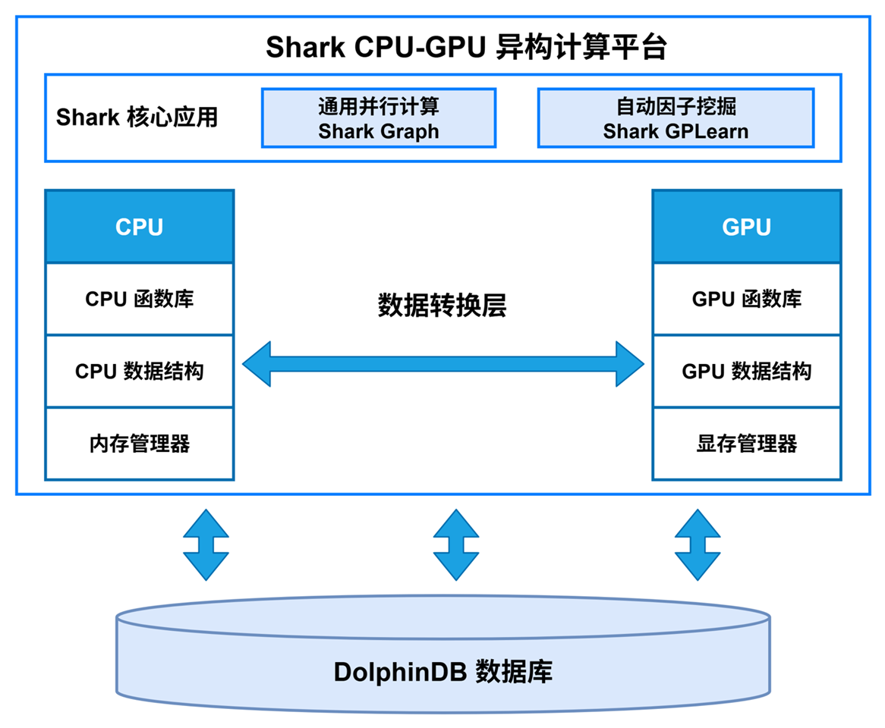

# 【Shark】产品单页（草稿）

- 信息来源: `assets/内部培训-Shark 异构平台-20250730.pptx`

---

**产品名称：** Shark 异构平台

**产品 slogan：** 面向高性能计算与业务建模的一体化异构计算平台

**视觉主图：** 

### 产品概述
**一句话定义：**

*一个面向 DolphinDB 业务场景的异构计算平台，通过 GPU 并行计算与可扩展计算框架，统一支持因子挖掘、通用并行计算和复杂定价加速。*

**核心定位：**
Shark 位于 DolphinDB 高性能数据处理能力之上，向上提供可直接落地的异构计算能力层。它重点解决三类问题: 
1. 因子挖掘训练慢、表达式搜索成本高。
2. 复杂业务逻辑难以高效迁移到 GPU。
3. 蒙特卡洛等高计算量定价与风险计算难以满足实时性要求。

**目标用户：**
- 量化研究员和因子研究员（高频/多频因子挖掘）
- 金融工程与量化开发团队（复杂定价与风险计算）
- 平台与架构团队（统一 GPU 计算能力接入）

---

### 优势与价值
*简要解释: 产品有什么能力能给客户带来什么。*

| 序号 | 关键特性 | 核心优势 | 客户价值 |
| --- | --- | --- | --- |
| 1 | `@gpu` 自定义函数能力，支持将 DolphinDB 函数自动编排到 GPU 执行 | 保持现有脚本语法与数据结构，低改造迁移，不需要额外 CUDA 开发 | 快速把计算密集任务迁移到高性能执行链路，缩短开发和上线周期 |
| 2 | Shark GPLearn 因子挖掘引擎（`createGPLearnEngine`、`gpFit`、`setGpFitnessFunc` 等） | 支持 `groupCol`、`dimReduceCol`、自定义适应度函数，覆盖分组与降频挖掘场景 | 提升候选因子搜索效率，缩短从因子构思到验证的周期 |
| 3 | 蒙卡路径加速与复杂定价加速（结构化产品定价、Greeks 计算） | 在大规模迭代下具备显著 GPU 并行优势，可支撑实时报价与风险计算 | 缩短定价与风控计算时延，提升盘中响应能力与业务吞吐 |

---

### 典型应用场景
*如果有客户案例可写客户背景，否则描述场景。*

| 序号 | 应用场景/客户背景 | 痛点 | 解决方案 | 应用价值 |
| --- | --- | --- | --- | --- |
| 1 | 高频因子挖掘场景：研究团队需在有限时间完成大量候选表达式训练与筛选 | 传统 CPU 训练耗时长、参数迭代慢、研究节奏受限 | 使用 Shark GPLearn + GPU 执行表达式，结合 `setGpFitnessFunc` 自定义评价指标进行批量训练 | 缩短训练周期，提升可迭代次数和候选因子覆盖度 |
| 2 | 结构化产品定价与风险计算：需进行蒙卡路径模拟、定价与 Greeks 计算 | 原系统计算时延高，难以满足实时报价和盘中风控 | 使用 Shark Graph + `@gpu` 将路径生成、敲入敲出判断、折现收益计算并行化 | 在大规模计算下显著降低时延，提升报价和风控响应效率 |
| 3 | 术语与口径统一：面向内外部文档对齐 | 对外单页与内部技术口径容易不一致 | 参考内部页面整理统一表达：[Shark 页面（Confluence）](https://dolphindb1.atlassian.net/wiki/spaces/pm/pages/1495433228/Shark) | 降低沟通成本，提升方案一致性和可复用性 |

---

### 参考链接
- [官方教程：Shark GPLearn 快速上手](https://docs.dolphindb.cn/zh/tutorials/gplearn.html)
- [官方教程：Shark GPLearn 应用说明](https://docs.dolphindb.cn/zh/tutorials/shark_gplearn_application.html)

---

### 底部统一标识
[ DolphinDB LOGO ] 或二维码

**官网：** http://dolphindb.cn

**邮箱：** sales@dolphindb.com

**电话：** 0571-82852925

**地址：** 浙江 杭州

**版本：** 2026-03-10 
